## flex

### 基本概念
采用 Flex 布局的元素，称为 Flex 容器（flex container），简称"容器"。它的所有子元素自动成为容器成员，称为 Flex 项目（flex item），简称"项目"。


容器默认存在两根轴：水平的主轴（main axis）和垂直的交叉轴（cross axis）

### 容器的属性

#### flex-direction

```css
/*  flex-direction可选值 */
div {
    flex-direction: row | row-reverse | column | column-reverse
}
```

设置效果如下：
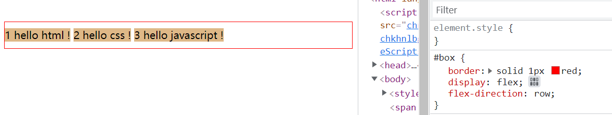

---

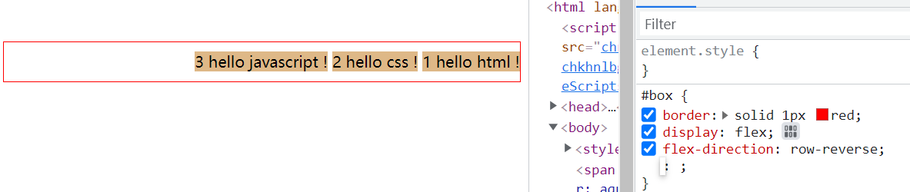

---

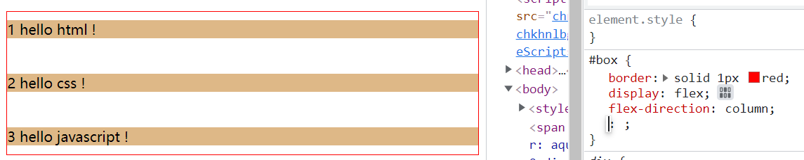

---

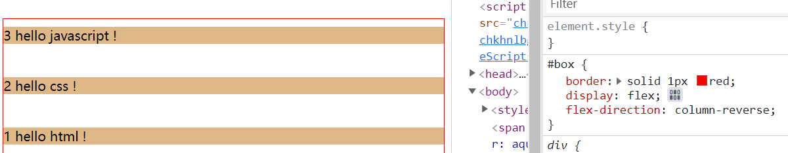


示例代码如下：

```html
   <style>
        .item {
            margin: 10px 0;
            background-color: burlywood;
        }
        #box {
            display: flex;
            flex-direction: row;
        }
    </style>
    <span style="background-color: aqua;">flex-direction: row</span>
    <div id="box">
        <span class="item">1 html</span>&nbsp;
        <span class="item">2 css</span>&nbsp;
        <span class="item">3 javascript</span>
    </div>
```

#### flex-wrap
```css
/* flex-wrap 可选值 */
div {
    flex-wrap: nowrap | wrap | wrap-reverse
}

```

宽度不够时：
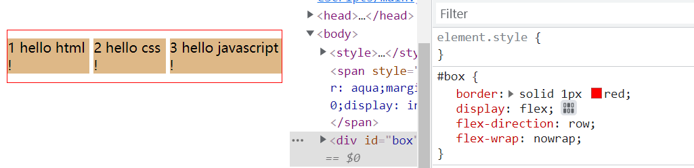

---

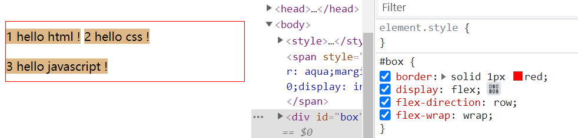

----

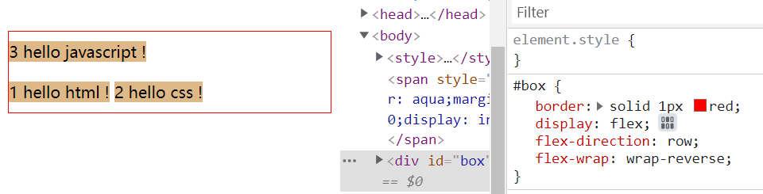


示例代码如下：

```html
<style>
    .item {
        margin: 10px 0;
        background-color: burlywood;
    }
    #box {
        border: solid 1px red;
        display: flex;
        flex-direction: row;
        flex-wrap: nowrap;
    }
</style>
<span style="background-color: aqua;margin-bottom: 10px;display: inline-block;">
    flex-wrap: nowrap
</span>
<div id="box">
    <span class="item">1 hello html ! </span>&nbsp;
    <span class="item">2 hello css ! </span>&nbsp;
    <span class="item">3 hello javascript !</span>
</div>
```

#### flex-flow
flex-flow是flex-direction和flex-wrap的简写形式
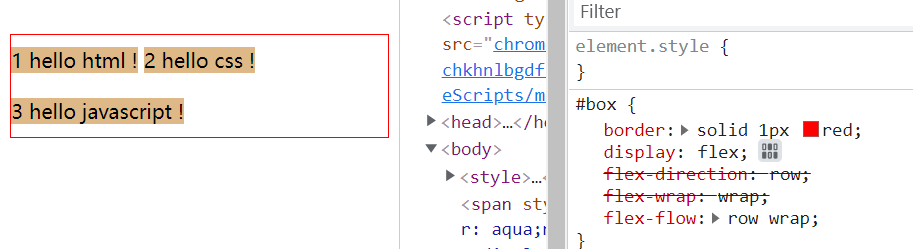

#### justify-content
定义了项目在主轴上的对齐方式    
```css
/* justify-content可选值 */
justify-content: flex-start | flex-end | center | space-between | space-around | space-evenly;
```
- flex-start(缺省): 从起点开始排列
- flex-end: 从终点开始排列
- center: 居中排列
- space-between: 项目均匀分配，第一项在起点线，最后一项在终点线
- space-around: 项目均匀分配，**每个**项目两侧有相同的留白空间A，所以相邻项目之间的距离是两个项目之间留白的和
- space-evenly: 项目均匀分布，所有项目之间或项目与边框之间距离相等

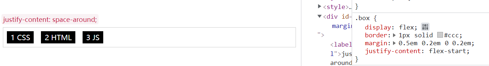

---

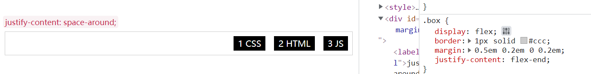

---

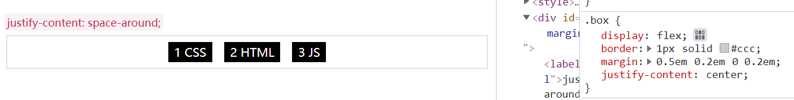

---

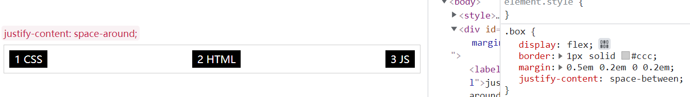

---

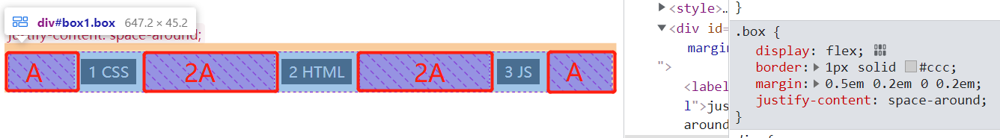

---

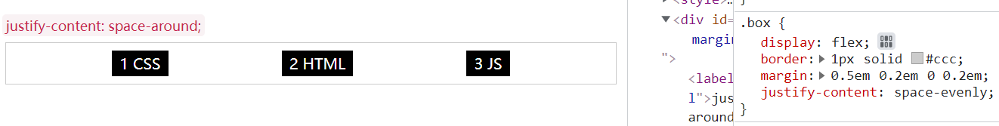


示例代码如下：
```html
<style>
    .box {
        display: flex;
        border : 1px solid #ccc;
        margin:0.5em 0.2em 0 0.2em;
    }
    .item {
        color:#fff;
        background: #000;
        padding: 0.2em 0.5em;
        margin: 0.5em;
        min-height: 1em;
        text-align: center;
    }
    label {
        padding: 2px 4px;
        font-size: 90%;
        color: #c7254e;
        background-color: #f9f2f4;
        border-radius: 4px;
    }
</style>
<div id="wrapper">
    <label for="box1" id="my-label">justify-content: flex-start; </label>
    <div class="box" id="box1">
        <div class="item">1 CSS</div>
        <div class="item">2 HTML</div>
        <div class="item">3 JS</div>
    </div>
</div>
```


#### align-items
定义项目在交叉轴上的对齐方式
```css
div {
    align-items: stretch | flex-start | flex-end | center | baseline;
}
```
- stretch（缺省）: 交叉轴方向拉伸显示
- flex-start: 按交叉轴起点线对齐
- flex-end: 按交叉轴终点线对齐
- flex-center: 按交叉轴中间对齐
- baseline:交叉轴方向按第一行文字基线对齐

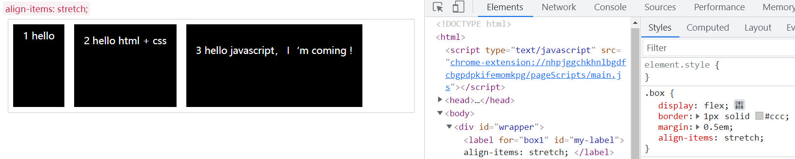

---

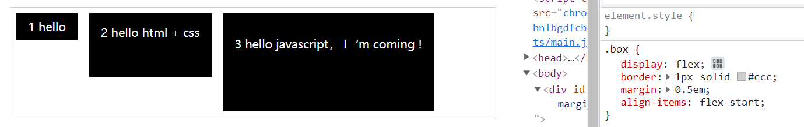

---

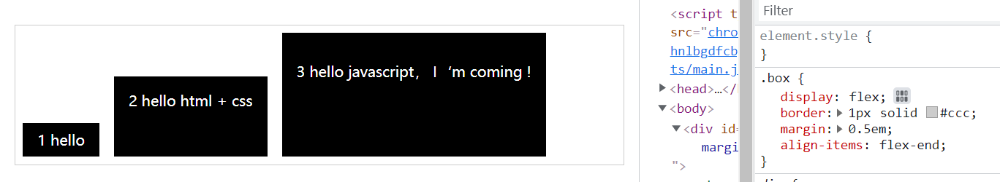

---

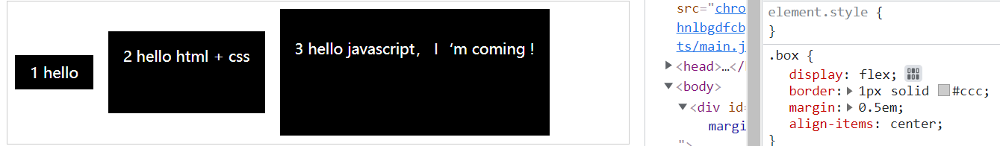

---

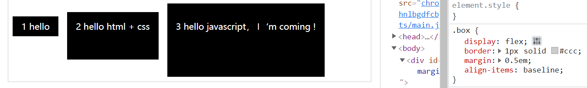

#### align-content
定义了在交叉轴方向的对齐方式，类似主轴上justify-content的作用

```css
div {
    align-content: stretch | flex-start | flex-end | center | space-between | space-around | space-evenly
}
```

`参考justify-content的用法`

### flex属性

#### order 
控制项目在容器中出现的先后顺序，默认是按照代码顺序排列
```css
.item {
    order: integer;  /* 默认0 */ 
}
```
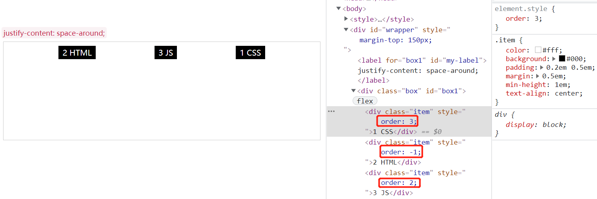

结论：按order值从小到大顺序排列，可以为负值，默认0

#### flex-grow 
定义项目的放大比例， 正整数，负值无效

```css
.item {
    flex-grow: <number>; /* 正整数，默认0 */
}
```
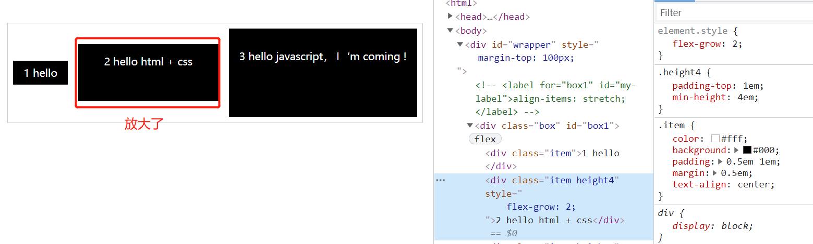

#### flex-shrink
定义项目的缩小比例， 默认1,0表示不缩小，负值无效，如果空间不足项目就会缩小
```css
.item {
    flex-shrink: <number>  /* 默认1 */
}
```
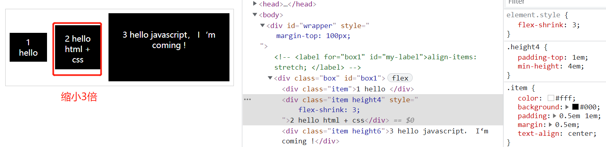

#### flex-basis 
定义项目在分配额外空间之前的缺省尺寸（设置项目宽度，空间足够，宽度是生效的）
```css
.item {
    flex-basis: <length> | auto; /*默认值 auto*/ 
}
```
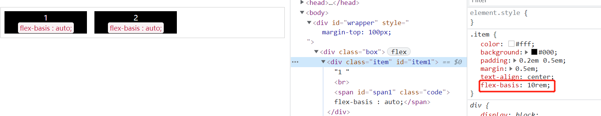


#### flex
flex是flex-grow,flex-shrink, flex-basis的简写~


#### align-self 
定义项目的对齐方式，可覆盖ailgn-items属性，默认auto (`自定义元素自己的对齐方式`)
```css
/* 基本语法 */
.item {
    align-self: auto | flex-start | flex-end | center | baseline | stretch
}
```

##### 参考文档

[【基础知识】Flex-弹性布局原来如此简单！！](https://juejin.cn/post/6844903586841755655)


