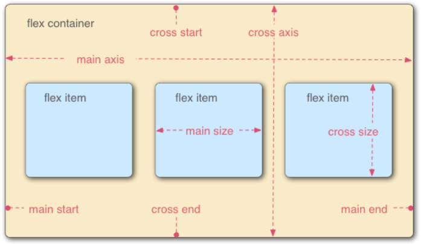

## flex

### 基本概念
采用 Flex 布局的元素，称为 Flex 容器（flex container），简称"容器"。它的所有子元素自动成为容器成员，称为 Flex 项目（flex item），简称"项目"。

容器默认存在两根轴：水平的主轴（main axis）和垂直的交叉轴（cross axis）

### 容器的属性

#### flex-direction
#### flex-wrap
#### flex-direction
#### flex-direction
#### flex-direction

